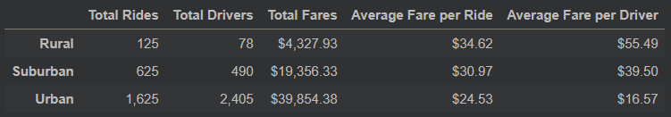

# PyBer Analysis

## Overview

## Results
#### PyBer Summary DataFrame

According to the PyBer Summary DataFrame, the rural city type had the lowest total rides (125) and the lowest total drivers (78). The urban city type had the highest total rides (1,625) and the highest total drivers (2,405). The suburban city type had a total ride count and total driver count of “625” and “490”, respectively. The urban city type had the highest total fares ($39,854.38), followed by the suburban city type ($19,356.33), and the rural city type ($4,327.93). There is also an inverse relationship between the “Total Riders” and “Total Drivers” with the “Average Fare per Ride and the “Average Fare per Driver”. The average fare decreases as the rides and drivers increase. The urban city type had the lowest average fare per ride ($24.53) and average fare per driver ($16.57). The rural city type has the highest average fare per ride ($34.62) and average fare per driver ($55.49). The suburban city type had an average fare per ride and average fare per driver of “$30.97” and “$39.50”, respectively. The average fare per ride can be explained based on the distance or duration of the trips. The rural cities likely have longer trips, resulting in higher average fares, compared to the suburban and urban cities.

#### Total Fare by City Type

The above multi-line graph shows the total weekly fares generated by city type during the months of January through April in 2019. The urban city type consistently generated the highest total fares, followed by the suburban city type, and the rural city type.

## Summary
Assuming that the total fares per ride is based on the distance or duration of the trips, below are my recommendations.
1. In urban cities, there is 1.48 times more drivers than there are rides. This means that there are some drivers not getting any rides at all. PyBer should implement incentives to boost ridership. Some options could include increasing marketing efforts of Pyber ride-share services or by making it more affordable to use PyBer’s service while limiting people from becoming drivers in urban cities (until ridership exceed drivers) to maintain profitability.

2. Since rural type cities have low ride and driver counts, I would increase marketing efforts to make PyBer more known in those cities. This will likely attract more people to become PyBer drivers as well as increase PyBer ridership.

3. Seeing that the suburban city type had moderate results, suburban cities could benefit from getting more drivers, or increased ridership, or both. We could potentially conduct more research to find out what the optimal rides to drivers ratio is and strive for that.
